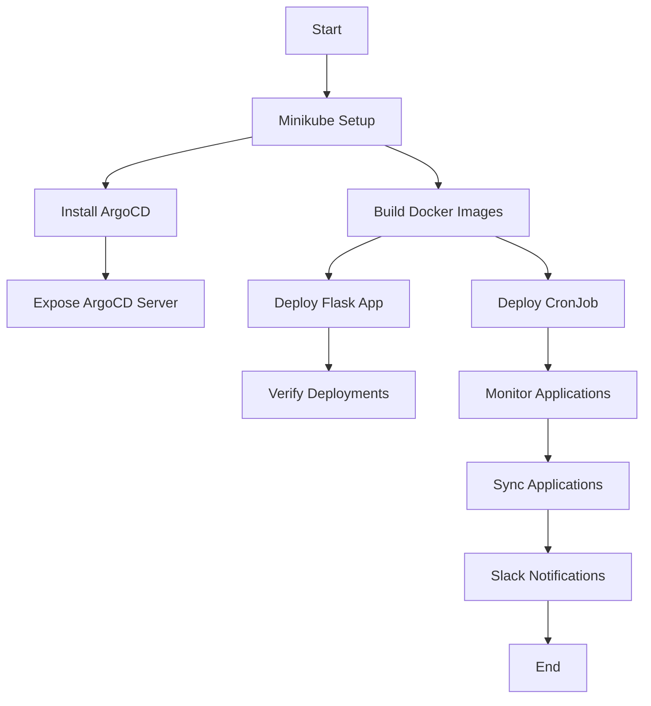

# Option 5: Kubernetes CronJob with Python Script and Flask Application

This project includes a Flask application deployed with ArgoCD and a CronJob that monitors all applications managed by ArgoCD. The CronJob attempts to synchronize applications in a degraded or error state and sends Slack notifications if issues persist.

---

## **Description**

- **Flask Application**: A simple Flask application deployed in Kubernetes and managed by ArgoCD.
- **CronJob**: Periodically checks the health of applications managed by ArgoCD. If an application is in a `Degraded` or `Error` state, it attempts to synchronize it up to 5 times. If the issue persists, the application is paused, and a Slack notification is sent.

---

## **Project Structure**

```plaintext
opcion5-cronjob-python/
├── app_flask/
│   ├── main.py                # Flask application code
│   ├── Dockerfile             # Dockerfile for Flask application
│   ├── deployment.yaml        # Kubernetes Deployment for Flask application
│   ├── service.yaml           # Kubernetes Service for Flask application
│   └── application.yaml       # ArgoCD Application configuration for Flask
├── cronjob/
│   ├── deploy_script.py       # Python script for the CronJob
│   ├── Dockerfile             # Dockerfile for the CronJob
│   ├── cronjob.yaml           # Kubernetes CronJob configuration
│   └── application.yaml       # ArgoCD Application configuration for CronJob
├── .github/
│   └── workflows/
│       ├── flask-app-deploy.yml  # GitHub Actions workflow for Flask app
│       └── cronjob-deploy.yml    # GitHub Actions workflow for CronJob
├── .env                       # Environment variables (not committed to Git)
├── .gitignore                 # Files ignored by Git
└── README.md                  # Project documentation
```

---

## **Prerequisites**

1. **Minikube**: Ensure Minikube is installed and running.
2. **ArgoCD**: Installed in the Kubernetes cluster.
3. **Slack Webhook**: A valid Slack webhook URL for notifications.
4. **Docker Hub Account**: For pushing Docker images.

---

## **Setup Instructions**

### **1. Start Minikube**

```bash
minikube start
kubectl config use-context minikube
```

### **2. Install ArgoCD**

1. Create the `argocd` namespace:
   ```bash
   kubectl create namespace argocd
   ```

2. Install ArgoCD:
   ```bash
   kubectl apply -n argocd -f https://raw.githubusercontent.com/argoproj/argo-cd/stable/manifests/install.yaml
   ```

3. Expose the ArgoCD server:
   ```bash
   kubectl patch svc argocd-server -n argocd -p '{"spec": {"type": "NodePort"}}'
   ```

4. Retrieve the initial admin password:
   ```bash
   kubectl get secret argocd-initial-admin-secret -n argocd -o jsonpath="{.data.password}" | base64 --decode; echo
   ```

---

### **3. Build and Push Docker Images**

1. **Flask Application**:
   ```bash
   docker build -t <your-dockerhub-username>/flask-app:latest ./app_flask
   docker push <your-dockerhub-username>/flask-app:latest
   ```

2. **CronJob**:
   ```bash
   docker build -t <your-dockerhub-username>/deploy-script:latest ./cronjob
   docker push <your-dockerhub-username>/deploy-script:latest
   ```

---

### **4. Deploy Resources to Kubernetes**

1. **Flask Application**:
   ```bash
   kubectl apply -f app_flask/deployment.yaml
   kubectl apply -f app_flask/service.yaml
   kubectl apply -f app_flask/application.yaml
   ```

2. **CronJob**:
   ```bash
   kubectl apply -f cronjob/cronjob.yaml
   kubectl apply -f cronjob/application.yaml
   ```

---

### **5. Verify Deployments**

1. **Check the Flask Service**:
   ```bash
   kubectl get svc flask-service -n poc
   ```

2. **Check the CronJob**:
   ```bash
   kubectl get cronjob deploy-checker -n argocd
   ```

3. **View Logs of CronJob Pods**:
   ```bash
   kubectl logs <pod-name> -n argocd
   ```

---

## **Flow Diagram**

Below is a textual representation of the project flow:

```plaintext
Start
  |
  v
[Minikube Setup] --> [Install ArgoCD]
  |                     |
  v                     v
[Build Docker Images]   [Expose ArgoCD Server]
  |                     |
  v                     v
[Deploy Flask App]      [Deploy CronJob]
  |                     |
  v                     v
[Verify Deployments]    [Monitor Applications]
  |                     |
  v                     v
[Slack Notifications] <--- [Sync Applications]
  |
  v
End
```

You can visualize this flow using a tool like Mermaid. Example:



---

## **GitHub Actions Workflows**

### **1. Flask Application Workflow**

- **File**: `.github/workflows/flask-app-deploy.yml`
- **Trigger**: Executes on changes in the `app_flask` directory.
- **Steps**:
  1. Build and push the Docker image for the Flask application.

### **2. CronJob Workflow**

- **File**: `.github/workflows/cronjob-deploy.yml`
- **Trigger**: Executes on changes in the `cronjob` directory.
- **Steps**:
  1. Build and push the Docker image for the CronJob.

---

## **Environment Variables**

### **1. `.env` File**

The `.env` file contains sensitive information and should not be committed to Git. Example:

```plaintext
ARGOCD_SERVER=localhost:8080
ARGOCD_USERNAME=admin
ARGOCD_PASSWORD=Thomas#1109
ARTIFACT_NAME=microservice
```

---

## **Error Handling and Validations**

### **Flask Application**

- **Error Handling**: The Flask application includes basic error handling for invalid routes.
- **Validation**: Ensure the `Dockerfile` and Kubernetes manifests are valid before deployment.

### **CronJob**

- **Error Handling**: The `deploy_script.py` includes error handling for failed synchronization attempts and Slack notification failures.
- **Validation**: Validate the `cronjob.yaml` file using:
  ```bash
  kubectl apply --dry-run=client -f cronjob/cronjob.yaml
  ```

---

## **Slack Notifications**

The CronJob sends notifications to Slack using the webhook URL stored in the Kubernetes secret `slack-webhook-secret`. To create the secret:

```bash
kubectl create secret generic slack-webhook-secret \
  --from-literal=SLACK_WEBHOOK_URL="https://hooks.slack.com/services/..." \
  -n argocd
```

---

## **Ingress Configuration**

If you want to expose the Flask application externally, configure an Ingress resource. Use the Minikube IP instead of `localhost`:

```bash
minikube ip
```

---

## **Conclusion**

With this setup, the Flask application and CronJob are managed by ArgoCD, ensuring that the repository is the single source of truth. GitHub Actions automates the build and push of Docker images, while ArgoCD handles synchronization and deployment.