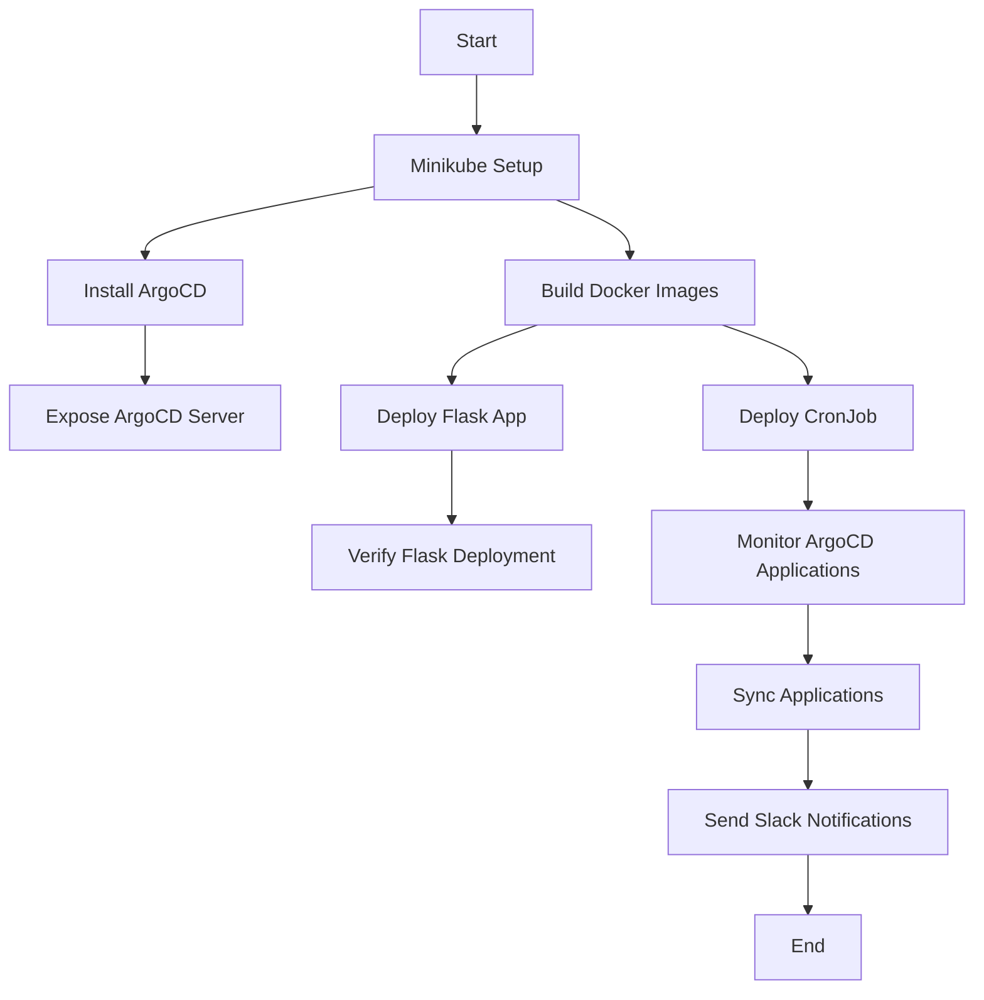

# Option 5: Kubernetes CronJob with Python Script and Flask Application

This project includes a Flask application deployed with ArgoCD and a CronJob that monitors all applications managed by ArgoCD. The CronJob attempts to synchronize applications in a degraded or error state and sends Slack notifications if issues persist.

---

## **Description**

- **Flask Application**: A simple Flask application deployed in Kubernetes and managed by ArgoCD.
- **CronJob**: Periodically checks the health of applications managed by ArgoCD. If an application is in a `Degraded` or `Error` state, it attempts to synchronize it up to 5 times. If the issue persists, the application is paused, and a Slack notification is sent.

---

## **Prerequisites**

1. **Minikube**: Ensure Minikube is installed and running.
2. **ArgoCD**: Installed in the Kubernetes cluster.
3. **Slack Webhook**: A valid Slack webhook URL for notifications.
4. **Docker Hub Account**: For pushing Docker images.
5. **kubectl**: Installed and configured to interact with your Kubernetes cluster.
6. **Python 3.9+**: Required for local testing of Python scripts.
7. **GitHub Actions**: Optional, for automating Docker image builds and pushes.

---

## **Project Structure**

```plaintext
opcion5-cronjob-python/
├── app_flask/
│   ├── main.py                # Flask application code
│   ├── template/              # HTML templates for Flask
│   ├── static/                # Static files (CSS, JS)
│   ├── Dockerfile             # Dockerfile for Flask application
│   ├── deployment.yaml        # Kubernetes Deployment for Flask application
│   ├── service.yaml           # Kubernetes Service for Flask application
│   └── application.yaml       # ArgoCD Application configuration for Flask
├── cronjob/
│   ├── script-py/             # Python scripts for the CronJob
│   │   ├── deploy_script.py   # Main script for the CronJob
│   │   ├── monitor.py         # Monitoring script
│   │   ├── slack_notifier.py  # Slack notification logic
│   │   ├── config.py          # Configuration loader
│   │   ├── argocd_client.py   # ArgoCD API client
│   ├── Dockerfile             # Dockerfile for the CronJob
│   ├── cronjob.yaml           # Kubernetes CronJob configuration
│   ├── role.yaml              # Role for accessing secrets
│   ├── rolebinding.yaml       # RoleBinding for accessing secrets
│   └── application.yaml       # ArgoCD Application configuration for CronJob
├── .github/
│   └── workflows/
│       ├── flask-app-deploy.yml  # GitHub Actions workflow for Flask app
│       └── cronjob-deploy.yml    # GitHub Actions workflow for CronJob
├── .env                       # Environment variables (not committed to Git)
├── .gitignore                 # Files ignored by Git
└── README.md                  # Project documentation
```

---

## **Setup Instructions**

### **1. Start Minikube**

1. Start Minikube:
   ```bash
   minikube start
   kubectl config use-context minikube
   ```

2. Verify Minikube is running:
   ```bash
   minikube status
   ```

3. Retrieve the Minikube IP:
   ```bash
   minikube ip
   ```

---

### **2. Install ArgoCD**

1. Create the `argocd` namespace:
   ```bash
   kubectl create namespace argocd
   ```

2. Install ArgoCD:
   ```bash
   kubectl apply -n argocd -f https://raw.githubusercontent.com/argoproj/argo-cd/stable/manifests/install.yaml
   ```

3. Expose the ArgoCD server:
   ```bash
   kubectl patch svc argocd-server -n argocd -p '{"spec": {"type": "NodePort"}}'
   ```

4. Retrieve the initial admin password:
   ```bash
   kubectl get secret argocd-initial-admin-secret -n argocd -o jsonpath="{.data.password}" | base64 --decode; echo
   ```

5. Access the ArgoCD UI:
   ```bash
   minikube service argocd-server -n argocd --url
   ```

---

### **3. Build and Push Docker Images**

1. **Flask Application**:
   ```bash
   docker build -t <your-dockerhub-username>/flask-app:latest ./app_flask
   docker push <your-dockerhub-username>/flask-app:latest
   ```

2. **CronJob**:
   ```bash
   docker build -t <your-dockerhub-username>/deploy-script:latest ./cronjob
   docker push <your-dockerhub-username>/deploy-script:latest
   ```

---

### **4. Deploy Resources to Kubernetes**

1. **Flask Application**:
   ```bash
   kubectl apply -f app_flask/deployment.yaml
   kubectl apply -f app_flask/service.yaml
   kubectl apply -f app_flask/application.yaml
   ```

2. **CronJob**:
   ```bash
   kubectl apply -f cronjob/role.yaml
   kubectl apply -f cronjob/rolebinding.yaml
   kubectl apply -f cronjob/cronjob.yaml
   kubectl apply -f cronjob/application.yaml
   ```

---

### **5. Verify Deployments**

1. **Check the Flask Service**:
   ```bash
   kubectl get svc flask-service -n poc
   ```

2. **Check the CronJob**:
   ```bash
   kubectl get cronjob deploy-checker -n argocd
   ```

3. **View Logs of CronJob Pods**:
   ```bash
   kubectl logs <pod-name> -n argocd
   ```

---

## **Environment Variables**

### **1. `.env` File**

The `.env` file contains sensitive information and should not be committed to Git. Example:

```plaintext
ARGOCD_SERVER=localhost:8080
ARGOCD_USERNAME=admin
ARGOCD_PASSWORD=admin123
ARGOCD_API=https://localhost:8080/api/v1
ARGOCD_TOKEN=<your-argocd-token>
SLACK_WEBHOOK_URL=https://hooks.slack.com/services/your/webhook/url
```

---

## **Common Errors and Solutions**

### **1. Missing `argocd-token-secret`**

**Error**:
```plaintext
Error: secret "argocd-token-secret" not found
```

**Solution**:
Create the missing secret:
```bash
kubectl create secret generic argocd-token-secret \
  --namespace argocd \
  --from-literal=token=<your-argocd-token>
```

Replace `<your-argocd-token>` with the actual token. You can generate it using:
```bash
argocd account generate-token --account admin
```

---

### **2. Slack Webhook Not Configured**

**Error**:
```plaintext
Error al enviar notificación a Slack: Invalid webhook URL
```

**Solution**:
Ensure the `slack-webhook-secret` exists and contains the correct URL:
```bash
kubectl create secret generic slack-webhook-secret \
  --from-literal=SLACK_WEBHOOK_URL="https://hooks.slack.com/services/your/webhook/url" \
  -n argocd
```

---

### **3. Minikube IP Not Resolved**

**Error**:
```plaintext
dial tcp: lookup $(MINIKUBE_IP): no such host
```

**Solution**:
Ensure the `initContainer` in the `cronjob.yaml` correctly retrieves the Minikube IP. Verify with:
```bash
minikube ip
```

---

### **4. ArgoCD Login Fails**

**Error**:
```plaintext
Error al autenticar en ArgoCD: Command '['argocd', 'login', ...]' returned non-zero exit status
```

**Solution**:
Verify the `ARGOCD_SERVER`, `ARGOCD_USERNAME`, and `ARGOCD_PASSWORD` environment variables are correct. Test the login manually:
```bash
argocd login <ARGOCD_SERVER> --username <ARGOCD_USERNAME> --password <ARGOCD_PASSWORD> --insecure
```

---

## **Flow Diagram**

Below is the updated flow diagram for the project:



---

## **Conclusion**

With this setup, the Flask application and CronJob are managed by ArgoCD, ensuring that the repository is the single source of truth. GitHub Actions automates the build and push of Docker images, while ArgoCD handles synchronization and deployment.